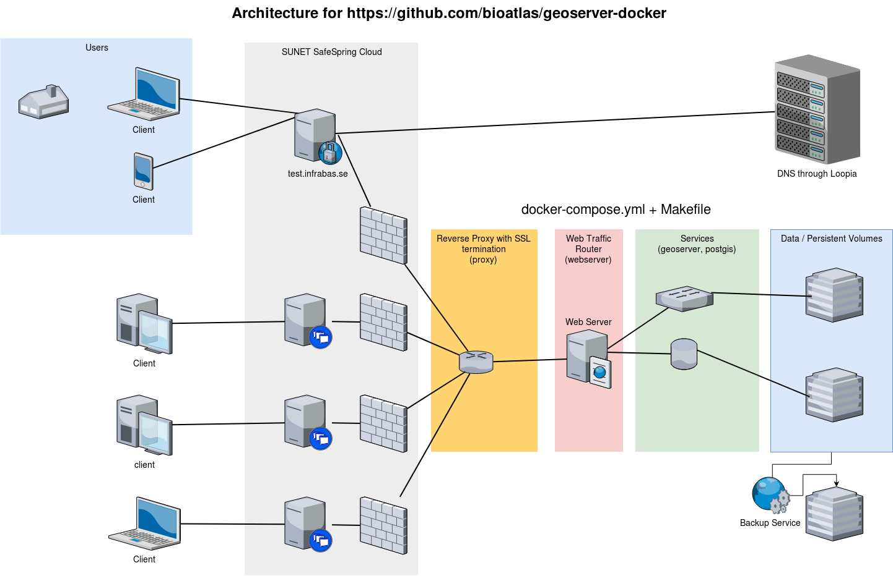

geoserver-docker
================

This project holds a dockerized service composition with geoserver and postgis. Here is an overview of this system:

The system components including relevant versioned images etc are listed in the `docker-compose.yml` file and the commands to manage the system are listed in the `Makefile`.

This system can run on a development server, such as on a developer's laptop, which has been configured beforehand with [docker and a few other development tools](https://bioatlas.github.io/requirements).

This rest of this intro will now describe how to deploy the same system on a production server.

Setting up a server in SUNET Cloud (SafeSpring Compute)
=======================================================

We start from scratch by provisioning a server in the Open Stack-based SUNET Compute Cloud (SafeSpring).

Docs from SafeSpring are available [here](https://docs.safespring.com/compute/getting-started/).

First install the python openstackclient

    apt install python-openstackclient

From the CLI you can then set up environment variables to connect - by sourcing a file from the openstack portal at <https://dashboard.cloud.sunet.se/project/access_and_security/api_access/openrc/>

    source ~/Downloads/bas-infra1.nrm.se-openrc.sh

Manage Open Stack from the CLI
------------------------------

You can now issue commands from the command line, such as:

    openstack network list
    openstack flavor list
    openstack ip floating pool list
    openstack image list
    openstack security group list

Install Docker Machine and provision a box
------------------------------------------

First install docker-machine from <https://github.com/docker/machine/releases>.

Make sure that open stack allows traffic from the docker daemon by adding TCP 2377 and TCP 2376 to security group "bioatlas-default".

Then provision a box with this command:

    docker-machine --debug create \
      --openstack-auth-url "https://keystone.api.cloud.ipnett.se/v3" \
      --openstack-tenant-id "4168b2afdf0f40949b340c7d9db0813a" \
      --openstack-sec-groups "bioatlas-default" \
      --openstack-domain-name "nrm.se" \
      --openstack-net-name "bioatlas-network" \
      --openstack-floatingip-pool "public-v4" \
      --openstack-ssh-user "ubuntu" \
      --openstack-image-name "ubuntu-18.04 [20180517]" \
      --openstack-flavor-name "b.large" \
      -d "openstack" test-geoserver

Note that `docker-machine` uses dotfiles in ~/.docker.

To upgrade and login to the box above, use....

    docker-machine upgrade test-geoserver
    docker-machine ssh test-geoserver

Production deployment
---------------------

We need to treat the production environment differently from a laptop-based development server.

For example, we need to have a firewall, set up DNS, SSL, review credentials used and set up backup/restore.

### Activate firewall and allow ssh and web traffic

    sudo ufw allow OpenSSH
    sudo ufw allow http
    sudo ufw allow https
    sudo ufw enable
    sudo ufw status

### Set up DNS

The `dnsmasq` component used on the development server doesn't need to run in production. Instead, to set up DNS, go to Loopia or equiv registrar and add "test.infrabas.se" as a subdomain with a DNS A entry pointing to the public ip that you get from the `docker-machine ip test-geoserver` command.

### Set up SSL

An TLS/SSL cert needs to be present in the production environment, for being able to use https. The `docker-compose.yml` file therefore needs a bind mount for the proxy component and the certs need to be present in the host's `certs` directory.

Then uncomment this line in the `docker-compose.yml` file in the section for the nginx proxy:

    - ./certs:/etc/nginx/certs:ro

### To deploy a docker-compose.yml file

Make sure you have `docker-compose`:

    sudo apt install python-pip
    sudo pip install docker-compose    

Also make sure you can run docker and docker-compose [with your user without having to use sudo](https://stackoverflow.com/questions/21871479/docker-cant-connect-to-docker-daemon/33596140#33596140):

    sudo groupadd docker
    sudo usermod -aG docker $(whoami)
    sudo service docker start

Then do this to get the code that defines the geoserver-docker system onto the server:

    mkdir repos
    cd repos
    git clone https://github.com/bioatlas/geoserver-docker.git
    cd geoserver-docker/
    mkdir certs

From your laptop do this to move the certs to the host:

    docker-machine scp -r certs test-geoserver:repos/geoserver-docker

Then change the credentials (held in the `.env`file which gets referenced in the docker-compose.yml file) used for the production environment.

While logged in on the host, build and start the system:

    cd repos/geoserver-docker
    make build
    make up

Note that starting the geoserver for the first time takes considerable time, several minutes.

Backup and restore
------------------

On the host, add a crontab entry for making backups:

    45 4 * * * bash -c 'cd /home/ubuntu/repos/geoserver-docker && make backup'

Also verify that the Makefile restore target works.
